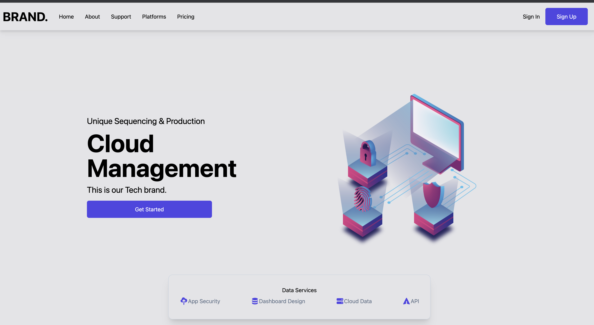
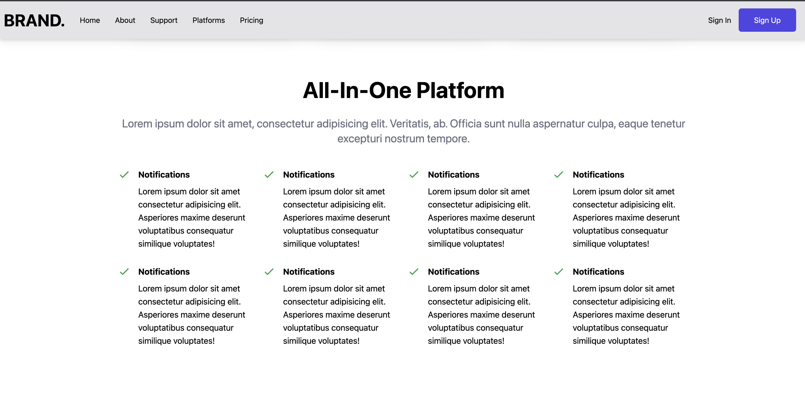
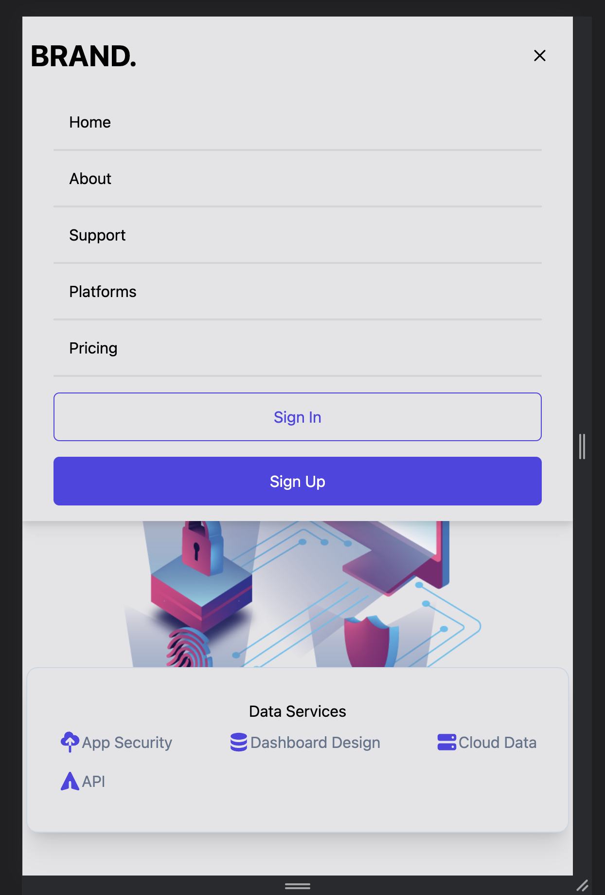
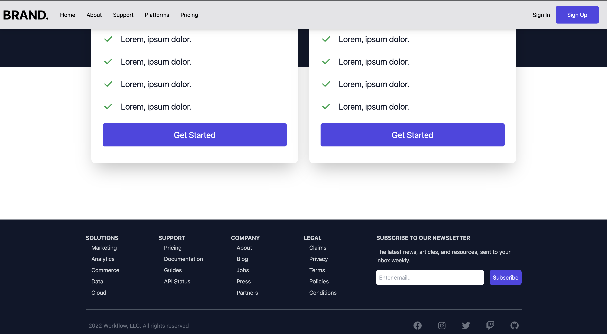

# Build a React JS Website with Tailwind CSS

Follow along and build this "Cloud Management" front in website using React JS and Tailwind CSS. 
I'm having a great time learning Tailwind and is unbelievably powerful! The time I save building applications is incredible! Thank you for following along and if you have any questions please let me know in the comments below.

# Goals

🏆 Build a React JS website - Beginner Guide
🏆 Tailwind CSS
🏆 useState Hook

💻 Screen shot   💻

🌏 ![demo] :(https://amazing-baklava-5be840.netlify.app/)